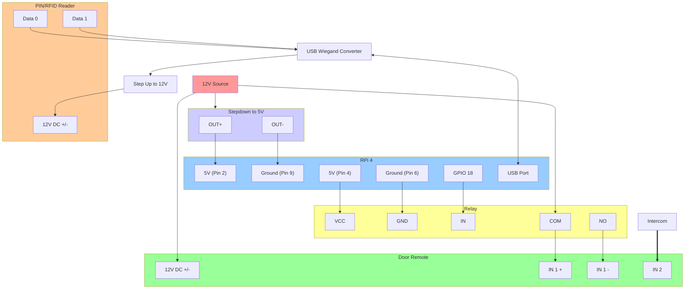

# access-api

Simple door lock system with PIN codes, RFID tags and remote unlocking using Raspberry PI.

The API records structured access events for PIN, RFID and remote unlock attempts.
Clients can read those events through `/access-events`, scoped by role. The Expo app
can also register native APNs or FCM push tokens through `/notification-devices` so
the backend can send access-event notifications directly through Apple and Google
without exposing notification credentials to clients.

Client apps in this monorepo:

- web: `../../apps/web`
- app: `../../apps/app`

## Hardware

Tested on Raspberry PI 4 and 5. On Raspberry PI 3, you will have trouble installing the required packages (in particular rpi-gpio) with Python 3.11. The code contains some async stuff that won't work on Python 3.9 (which is the default on Raspberry PI 3) and rpi.gpio won't run on Python 3.11 on Raspberry PI 3 (`version `GLIBC_2.34' not found`).

This will work with any relay operated lock that you can control from the GPIO pins of a Raspberry PI. You have to set up wiring so that the PI sends a door unlocking signal by activating a relay on a 12-24 V circuit connected to the I/O module. Tested with the I/O Module from SÜDMETALL (https://www.suedmetall.com/products/locking-systems/stand-alone-solutions/i-o-modul/?lang=en).

By default, the code expects the relay to be connected to GPIO pin 18, but this can be changed by setting the `RELAY_PIN` environment variable.

As for the PIN/RFID reader, the code is prepared to take normal "keyboard" input (evdev) - some USB-connected readers work like that. In development, you'll probably want to use terminal input, so set INPUT_SOURCE to terminal.

There is also a special mode called T9EM - I need to add more details on that but it's basically for a specific combination of the Asia-Teco "T9" Wiegand reader (http://www.asia-teco.com/en/h-por-j-262-5_262.html) which I got from Aliexpress (https://www.aliexpress.com/item/1005006244356261.html?spm=a2g0o.order_detail.order_detail_item.3.21fef19cNaLXvx) and a specific Wiegand to USB converter. You can select it by setting the INPUT_SOURCE environment variable to T9 (or T9EM - need to check.)

### Wiring

See the wiring I am using with a Wiegand reader and a Wiegand to USB converter below. You could also connect the 12V source directly to the PIN/card rearder, which might help prevent undervoltage on the RPi.



## Install

```bash
python -m venv .venv
. .venv/bin/activate
pip install --upgrade pip
pip install -r requirements.txt
```

If you encounter an error installing `evdev`, try installing the `python3-evdev` package with `sudo apt-get install python3-evdev`. In that case you may want to create the virtual environment with the `--system-site-packages` flag (i.e. `python -m venv .venv --system-site-packages`) and ignore the `evdev` package in the `requirements.txt` file with `grep -v "evdev" requirements.txt | pip install -r /dev/stdin`.

If you want to get the latest versions of all the required packages, you can try running `pip install fastapi sqlalchemy boto3 python-dotenv uvicorn "pydantic[email]" rpi-lgpio evdev "httpx[http2]" "PyJWT[crypto]" google-auth requests` directly.

### Development

For development on a machine which doesn't support `RPi.GPIO` and `evdev`, run just `pip install fastapi sqlalchemy boto3 python-dotenv uvicorn "pydantic[email]" "httpx[http2]" "PyJWT[crypto]" google-auth requests` to exclude these packages.

Then run the setup script to create a dummy `RPi` package:

```bash
./setup_mock_rpi_gpio.sh
```

## Push Notifications

The backend sends access-event notifications directly to the platform providers:

- iOS devices register APNs tokens and are sent through APNs.
- Android devices register FCM tokens and are sent through FCM HTTP v1.

The `/notification-devices` registration payload is:

```json
{
  "push_token": "native-device-token",
  "provider": "apns",
  "platform": "ios",
  "environment": "production"
}
```

Use `provider: "fcm"` and `platform: "android"` for Android. APNs
`environment` can be `sandbox` or `production`; if omitted, the backend uses
`APNS_DEFAULT_ENVIRONMENT`.

Required backend config for APNs:

- `APNS_TEAM_ID`
- `APNS_KEY_ID`
- `APNS_TOPIC` (the iOS app bundle identifier)
- `APNS_KEY_FILE` or `APNS_PRIVATE_KEY`

Required backend config for FCM:

- `FCM_PROJECT_ID`
- `FCM_SERVICE_ACCOUNT_FILE` or `FCM_SERVICE_ACCOUNT_JSON`

Alternatively, set `GOOGLE_APPLICATION_CREDENTIALS` and `FCM_USE_ADC=1` to use
Google Application Default Credentials.

The service account needs permission to send Firebase Cloud Messaging HTTP v1
messages. Keep APNs `.p8` keys and FCM service account JSON files off the client
and out of git.

To verify delivery after a native app has registered a device token, call:

```bash
curl -X POST "$API_URL/notification-devices/test" \
  -H "Authorization: Bearer $TOKEN"
```

The endpoint sends a test notification to the current user's active APNs/FCM
devices and returns one result per registered device. It uses the same direct
provider clients as access-event notifications.

## Networking

Because this will be running on a Raspberry PI - likely without a static public IP address or port forwarding, you will need a way of opening it up to recieve HTTP requests. There are multiple ways: traditionally you'd use port forwarding to another server exposed to the Internet, or you can use a service like Cloudflare Tunnels instead.

### Option 1: Cloudflare tunnel

Cloudflare Tunnels provide a secure way to expose your Raspberry PI to the internet without opening ports on your router or having a static IP address. This is the recommended approach as it's more secure and easier to set up than traditional port forwarding.

#### Prerequisites

1. A Cloudflare account (free tier works fine)
2. A domain name managed by Cloudflare
3. Your Raspberry PI connected to the internet

#### Setup Steps

1. **Install cloudflared on your Raspberry PI:**

   ```bash
   # Download the latest cloudflared for ARM64 (RPi 4/5) or ARM (RPi 3)
   # For RPi 4/5 (ARM64):
   wget https://github.com/cloudflare/cloudflared/releases/latest/download/cloudflared-linux-arm64
   sudo mv cloudflared-linux-arm64 /usr/local/bin/cloudflared
   sudo chmod +x /usr/local/bin/cloudflared
   
   # For RPi 3 (ARM):
   # wget https://github.com/cloudflare/cloudflared/releases/latest/download/cloudflared-linux-arm
   # sudo mv cloudflared-linux-arm /usr/local/bin/cloudflared
   # sudo chmod +x /usr/local/bin/cloudflared
   ```

2. **Authenticate cloudflared with your Cloudflare account:**

   ```bash
   cloudflared tunnel login
   ```

   This will open a browser window where you need to select your domain and authorize the tunnel.

3. **Create a tunnel:**

   ```bash
   cloudflared tunnel create access-api
   ```

   This creates a tunnel and generates a tunnel ID. Note down the tunnel ID for later use.

4. **Create a configuration file:**

   Create `/home/pi/.cloudflared/config.yml` (replace `<TUNNEL_ID>` with your actual tunnel ID):

   ```yaml
   tunnel: <TUNNEL_ID>
   credentials-file: /home/pi/.cloudflared/<TUNNEL_ID>.json
   
   ingress:
     - hostname: door.yourdomain.com
       service: http://localhost:8000
     - service: http_status:404
   ```

5. **Create a DNS record:**

   ```bash
   cloudflared tunnel route dns access-api door.yourdomain.com
   ```

   Replace `door.yourdomain.com` with your desired subdomain.

6. **Test the tunnel:**

   Start your access API server:
   ```bash
   uvicorn api:app --host 0.0.0.0 --port 8000
   ```

   In another terminal, start the tunnel:
   ```bash
   cloudflared tunnel run access-api
   ```

   Your API should now be accessible at `https://door.yourdomain.com`

7. **Set up as a system service (optional but recommended):**

   Create a systemd service file at `/etc/systemd/system/cloudflared.service`:

   ```ini
   [Unit]
   Description=Cloudflare Tunnel
   After=network.target
   
   [Service]
   Type=simple
   User=pi
   ExecStart=/usr/local/bin/cloudflared tunnel run access-api
   Restart=always
   RestartSec=5
   KillMode=mixed
   
   [Install]
   WantedBy=multi-user.target
   ```

   Enable and start the service:
   ```bash
   sudo systemctl enable cloudflared
   sudo systemctl start cloudflared
   ```

#### Security Considerations

- Your tunnel is automatically secured with TLS
- Consider adding Cloudflare Access rules to restrict who can access your door control system
- You can add additional authentication layers through Cloudflare's security features
- Monitor access logs through the Cloudflare dashboard

### Option 2: Use another server as a proxy to forward requests to the Raspberry PI.

On the Raspberry PI, set up reverse port forwarding like this:

```bash
ssh -R 8000:localhost:8000 <server>
```

Or use autossh to keep the connection alive, for example:

```bash
autossh -M 20000 -N -R 8000:localhost:8000 username@proxy-server -o "ServerAliveInterval 30" -o "ServerAliveCountMax 3"
```

You can even set it up as a systemd service to run in the background like this:

```bash
[Unit]
Description=AutoSSH tunnel service for port 4444
After=network.target

[Service]
User=pi
Group=pi
ExecStart=/usr/bin/autossh -M 20000 -N -R 8000:localhost:8000 username@proxy-server -o "ServerAliveInterval 30" -o "ServerAliveCountMax 3"
Restart=always
RestartSec=3
StartLimitIntervalSec=60
StartLimitBurst=10

[Install]
WantedBy=multi-user.target
```

## Usage

### First-time setup

Set environment variables to configure the app. First copy the example file with `cp .env.example .env` and then edit as needed.

Login emails include both a code and a clickable link. The link is built from `WEB_APP_URL` with `/login` appended.

Run `python setup.py` to create the database and set up the first user. You can also use a CSV file with usernames and PIN codes to create multiple users at once - use the `users.csv.example` as a template.

### Launching the API server

Launch the API server with `uvicorn api:app` (or with the `--reload` flag for development).

You need to obtain credentials first to use the API directly. You can either sign in through one of the clients and use the bearer token from the `Authorization` header, or create an API key from the admin profile settings in the web or Expo app. API keys are accepted through the `X-API-Key` header or the `api_key` query parameter.

#### User Roles

The system supports four user roles with different permission levels:

##### 1. **Admin** 
- Full system access
- Can manage all users across all apartments
- Can create/update/delete any user, PIN, RFID, or API key
- Can access all system endpoints and administrative functions

##### 2. **Apartment Admin**
- Can manage users within their own apartment only
- Can create/update/delete users, PINs, RFIDs for users in their apartment
- Can view apartment-specific data and manage guest schedules
- Cannot access other apartments or system-wide settings

##### 3. **User** 
- Regular apartment resident with self-management capabilities
- Can create/update/delete their own PINs (with custom PIN values)
- Can create/update/delete their own RFIDs and API keys
- Can view their own profile information
- Has 24/7 access (no schedule restrictions)
- **Cannot** create other users or access apartment-wide data
- **Cannot** be put on guest schedules

##### 4. **Guest**
- Very limited access for temporary users
- PINs are automatically generated (cannot set custom PINs)
- Can be put on time-based access schedules
- Subject to schedule restrictions (access only during allowed times)
- Can only manage their own credentials
- Cannot create other users or access apartment data

##### Key Role Differences

| Feature | Admin | Apartment Admin | User | Guest |
|---------|-------|----------------|------|--------|
| User Management | ✅ All apartments | ✅ Own apartment | ❌ None | ❌ None |
| Custom PINs | ✅ Any user | ✅ Apartment users | ✅ Self only | ❌ Auto-generated |
| Access Schedules | ✅ Manage all | ✅ Apartment guests | ❌ Not scheduled | ⏰ Subject to schedules |
| System Access | 🕐 24/7 | 🕐 24/7 | 🕐 24/7 | ⏰ Scheduled only |
| Data Visibility | 👁️ System-wide | 👁️ Apartment-wide | 👁️ Self only | 👁️ Self only |

##### PIN Privacy and Duplicate PIN Trade-offs

PINs are short access credentials, not strong private secrets. Because the default
PIN length is small, an administrator with database access can brute-force salted
PIN hashes by trying every possible PIN value. Salting still prevents simple hash
comparison and precomputed lookup, but it does not make short PINs private from
trusted operators.

By default, the system always auto-generates guest PINs. `GUEST_PIN_MODE` can
change this:

- `generated` (default): guest PINs are always generated by the backend.
- `custom_until_scheduled`: guests may choose custom PINs while they have no
  schedules. If all schedules are deleted later, custom guest PINs are allowed
  again.

When scheduled access is first added for a guest, all of that guest's existing
PINs are deleted and a new unique PIN is generated. This avoids telling the guest
or admin which old PINs, if any, were duplicates. Scheduled access needs a unique
PIN so time limits can be enforced.

`PIN_UNIQUENESS_MODE` controls duplicate checks for custom PINs:

- `global`: all PINs must be unique.
- `scheduled` (default): scheduled-access PINs must be unique; ordinary resident
  duplicates are allowed.
- `off`: ordinary duplicate checks are disabled, but scheduled-access PINs are
  still protected because schedules cannot be enforced safely with shared PINs.

If two unscheduled people share the same PIN, the keypad input cannot prove which
person physically opened the door. Access logs mark the PIN match as shared, and
both users may get notifications when the PIN is used.

Disallowing duplicate PINs improves auditability, but it also leaks information:
when a user is told that a PIN is already in use, they learn that the PIN is a
valid door credential. Since knowing the PIN is enough to use it, duplicate-PIN
validation is not privacy preserving for low-trust users.

For operational clarity, admins should treat personal PINs as unique per-user
credentials. If a PIN is intentionally shared, users should be told: "A PIN is a
door code, not a private password. If two people use the same PIN, they both may
get notifications when the PIN is used."
